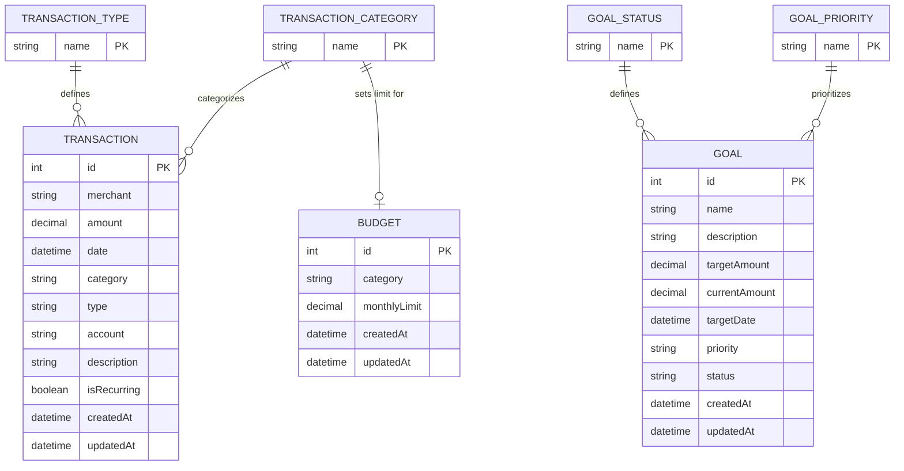

# AI Personal Finance Copilot — Entity Relationship Diagram



## Schema Notes

### Transaction

Stores all income and expense activity.

- `id` — Primary key
- `merchant` — Merchant or transaction source
- `amount` — Transaction amount
- `date` — Transaction date stored in UTC
- `category` — Transaction category
- `type` — INCOME or EXPENSE
- `account` — Account name
- `description` — Optional transaction description
- `isRecurring` — Indicates whether the transaction is recurring
- `createdAt` — Record creation timestamp
- `updatedAt` — Record update timestamp

### Budget

Stores monthly spending limits by category.

- `id` — Primary key
- `category` — Category the budget applies to
- `monthlyLimit` — Maximum monthly spending amount
- `createdAt` — Record creation timestamp
- `updatedAt` — Record update timestamp

One budget should exist per category.

### Goal

Stores user savings goals.

- `id` — Primary key
- `name` — Goal name
- `description` — Optional goal description
- `targetAmount` — Total amount needed
- `currentAmount` — Current savings progress
- `targetDate` — Desired completion date
- `priority` — LOW, MEDIUM, or HIGH
- `status` — ACTIVE, PAUSED, or COMPLETED
- `createdAt` — Record creation timestamp
- `updatedAt` — Record update timestamp

## Enums

### TransactionType

- `INCOME`
- `EXPENSE`

### TransactionCategory

- `HOUSING`
- `FOOD_AND_DINING`
- `TRANSPORTATION`
- `SHOPPING`
- `ENTERTAINMENT`
- `SUBSCRIPTIONS`
- `INCOME`
- `OTHER`

### GoalPriority

- `LOW`
- `MEDIUM`
- `HIGH`

### GoalStatus

- `ACTIVE`
- `PAUSED`
- `COMPLETED`

## Relationships

- One `TransactionCategory` can belong to many `Transaction` records.
- One `TransactionType` can belong to many `Transaction` records.
- One `TransactionCategory` can have one `Budget`.
- One `GoalPriority` can belong to many `Goal` records.
- One `GoalStatus` can belong to many `Goal` records.
- Transactions and Goals do not have a direct relationship in Phase 3.
- Budgets and Goals do not have a direct relationship in Phase 3.

## Phase 3 Assumptions

- Categories are fixed enums.
- Users cannot create custom categories yet.
- Accounts are stored as freeform strings.
- There is no Account table yet.
- Recurring transactions are manually flagged.
- Budget/category relationships are primarily enforced by application logic.
- Transactions are not directly linked to goals yet.

## Future Enhancements

Phase 5 and beyond can introduce:

- `Account` table
- `Tag` table
- `TransactionSplit` table
- `BudgetAdjustment` table
- `GoalTransaction` join table
- Automatic recurring transaction detection
- Dynamic categories
- Multi-account reconciliation
- Account-specific transaction filtering
- Goal contribution tracking

A future Account relationship could look like:

```text
ACCOUNT
   |
   | 1
   |
   | many
   v
TRANSACTION
```

With:

```text
Transaction.accountId -> Account.id
```

This would replace the current freeform `account` string.